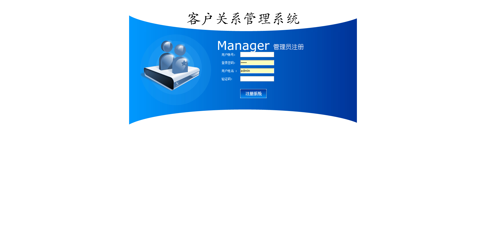
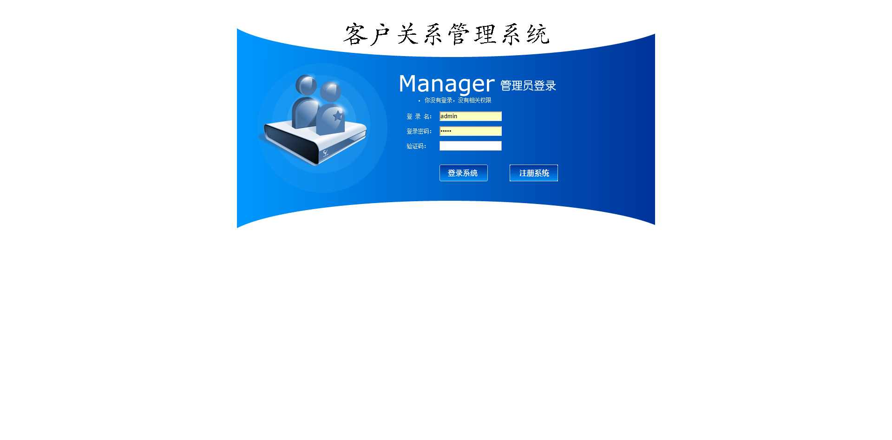
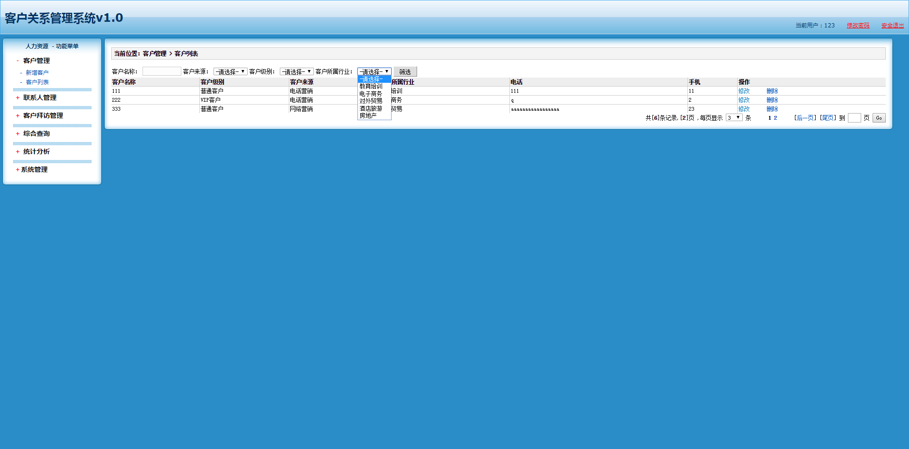
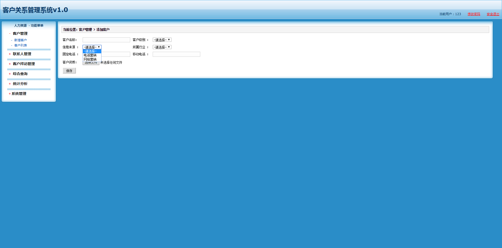

#CRM
CRM-SSH框架
##技术点
1. Struts2
2. hibernate5
3. spring3
4. c3p0
5. log4j

##功能点
1. 用户模块
    * 登录
    * 注册
2. 客户管理模块
    * 客户列表:分页查询、条件查询
    * 新增客户:带文件上传
    * 修改客户
    * 删除客户
3. 联系人模块
    * 添加联系人
    * 查询联系人
    * 修改联系人
    * 删除联系人
4. 客户拜访记录管理模块
    * 拜访列表：分页、时间区间查询
    * 新增拜访
##部分截图

